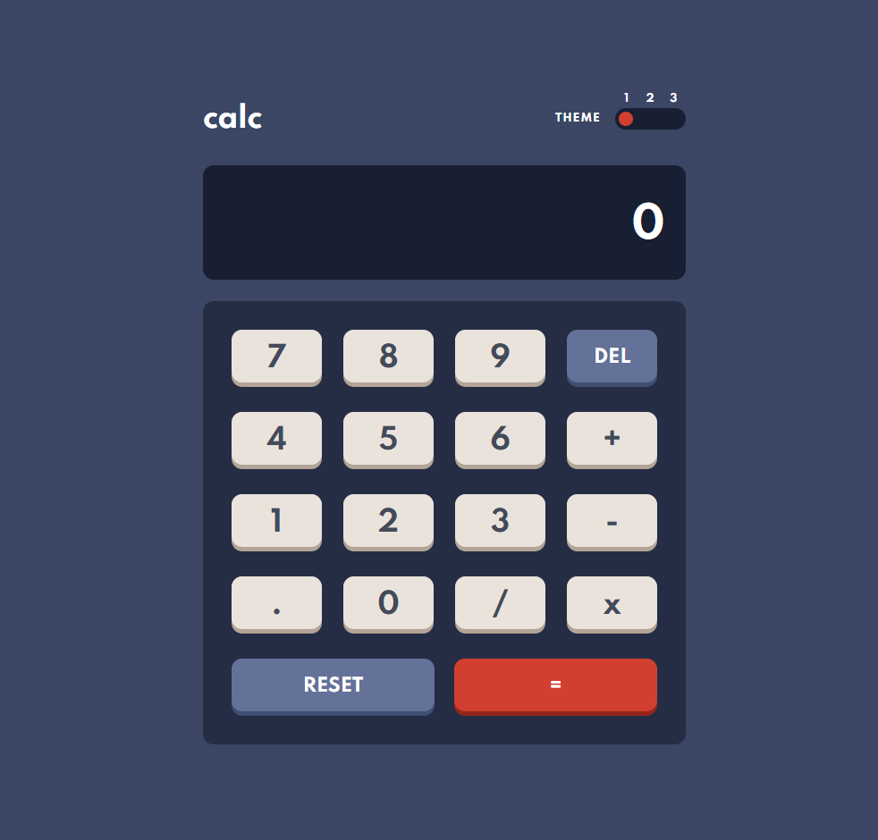

# Frontend Mentor - Calculator app solution

This is a solution to the [Calculator app challenge on Frontend Mentor](https://www.frontendmentor.io/challenges/calculator-app-9lteq5N29). Frontend Mentor challenges help you improve your coding skills by building realistic projects. 

## Table of contents

- [Overview](#overview)
  - [The challenge](#the-challenge)
  - [Screenshot](#screenshot)
  - [Links](#links)
- [My process](#my-process)
  - [Built with](#built-with)
  - [What I learned](#what-i-learned)
- [Author](#author)


**Note: Delete this note and update the table of contents based on what sections you keep.**

## Overview

### The challenge

Users should be able to:

- See the size of the elements adjust based on their device's screen size
- Perform mathmatical operations like addition, subtraction, multiplication, and division
- Adjust the color theme based on their preference
- **Bonus**: Have their initial theme preference checked using `prefers-color-scheme` and have any additional changes saved in the browser

### Screenshot



### Links

- Solution URL: [Frontend Mentor](https://your-solution-url.com)
- Live Site URL: [Vercel App](https://calculator-gstormx2.vercel.app/)

## My process

### Built with

- [React](https://reactjs.org/) - JS library
- [TailwindCSS](https://tailwindcss.com) - Utility-first CSS Framework
- CSS custom properties
- Flexbox
- Grid


### What I learned

- Making custom global themes with tailwind and switching between them with React Context API. CSS variables are defined in ```index.css``` based on theme, and then custom classes for text and background are defined in ```tailwind.config.js``` based on those variables. I just add the custom classes inside divs that require theme specific style and dynamically set the theme class inside parent div with ```useContext``` hook.

- I've also learned animation basics while implementing theme switcher knob movement. In order for movement animation to work dynamically, I changed the knob position towards certain direction (```left``` and ```-left```) everytime.

- Finally, the trickiest part was implementing the calculator engine. I wanted it to work just like the iOS calculator and after hours of trying and brainstorming, I came up with a solution that was inspired by state machines. Every action by the user changes the state of the calculator to what it is *expecting* next.
  - **Example**: Initially the expectation is empty. It can expect both a ``number`` or an ``operand``. Once it recieves a number or an operand, it changes expectation to the opposite. Getting number changes it to operand and vice versa. While expecting number, users can freely change the operand (+ , - , *, /). And while expecting operand, users can freely edit the number. Result comes based on state changes from operand. this code is implemented inside ```src/components/Body.jsx```.     

Overall this project was a great learning experience!


## Author

- Frontend Mentor - [@GStormx2](https://www.frontendmentor.io/profile/GStormx2)

